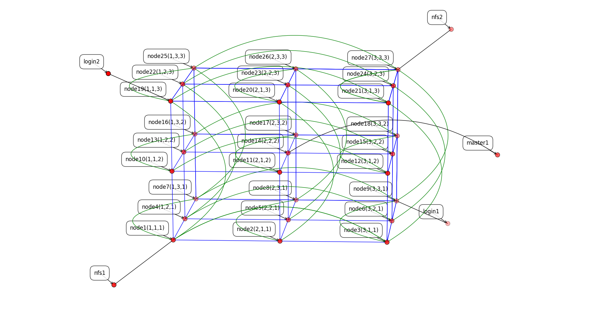
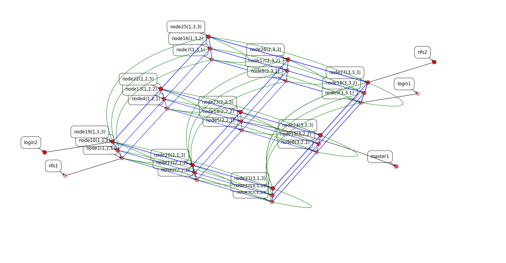
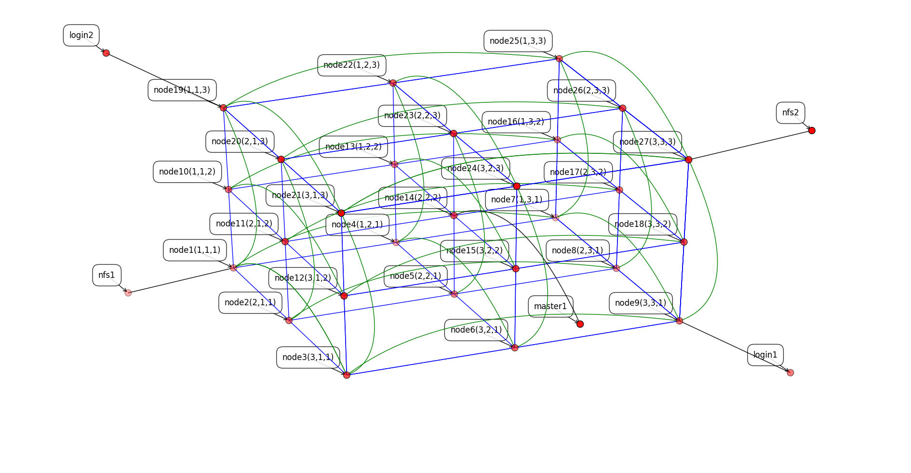
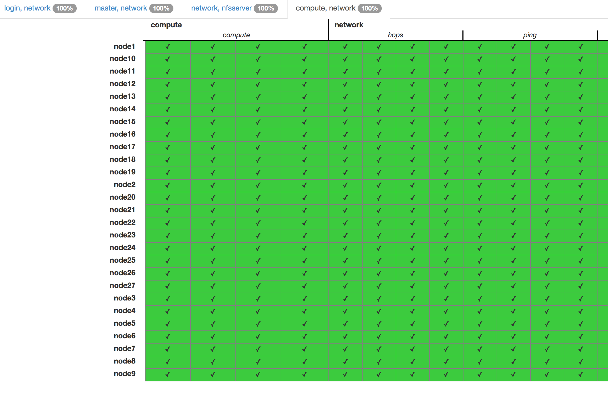

Vagrant Mesh Network for an HPC Cluster Environment
===================================================

This repository contains a yaml, vagrant and other configuration files for setting up a virtual HPC Cluster Environment.
The execution hosts are connected via a 3D Torus Network.

Needed Software
---------------

* [Ruby](https://www.ruby-lang.org) (Version 2.2.2 or later)
* [Vagrant](https://www.vagrantup.com) (Version 1.7.2 or later)
* [Packer](https://www.packer.io) (Version 0.8.2 or later)
* [VirtualBox](https://www.virtualbox.org) (Version 4.3.30 or later)
* [Serverspec](http://serverspec.org) (Version 2.2.0 or later)
* [Univa Grid Engine](http://www.univa.com) (Version 8.2.0) (Trial Version)

Why HPC Clusters
----------------

Many fields in research and science require to analyze much data. With a single computer it would take up days or weeks to wait for your results, but if you have the chance to use a HPC Cluster you get results much faster (in our example within hours). Normally HPC Clusters are for universities and research institutes, but with our little project you can run your own HPC Cluster on your Computer in a few steps. Of course it would not be as fast as one of the HPC Clusters in the [TOP 500](http://www.top500.org) list, but it uses the same concept that powers many of the other computers on the list.

The Torus Network
-----------------

As described above we are using 3D Torus to connect our execution hosts with each other. The Service Nodes (NFS-Servers, Login-Nodes, Queue-Master) are connected to individual hosts configurable via *cluster.yml*. The idea of using a 3D Torus network as an interconnect  was also used by Christopher L. Lydick in his [Master thesis](http://krex.k-state.edu/dspace/handle/2097/808). We implemented his IP address generation algorithm for our torus.

* Green lines are edge connections.
* Blue lines are are normal connections between the hosts.
* Black lines are connections to service nodes.


This Picture shows the Torus Network.


Here you can see the edge connections.




Create the base box
-------------------

Go into the "packer" directory and run

```
[user@host packer]$ rake
Rakefile for creating Box with packer

rake [options]

Options:
   *) build -- Builds the box from template
   *) check -- Checks if the box config is correct
   *) buildcheck -- Builds and checks the box
```

Now choose an option, for this example we choose the *buildcheck* option:

```
[user@host packer]$ rake buildcheck
virtualbox-iso output will be in this color.

...

Machine build correctly. File: centos6-x64.box

...

Finished in 3.74 seconds (files took 38.6 seconds to load)
8 examples, 0 failures

Machine installed correctly
```

After the machine has been build rake outputs that the machine was build correctly. Now the machine is tested if all required porgrams are installed, settings are made correctly and if the vagrant users exist and is able to login via public key over ssh. If it ends with 'Machine installed correctly' everything is fine and the machine is ready to use.

Last you have to add the file *centos6-x64.box* to the vagrant box list:

```sh
[user@host packer]$ vagrant box add centos6 centos6-x64.box
```

Starting up the HPC Cluster
---------------------------

After you created and imported the base box, you just have to say

```sh
[user@host ~]$ vagrant up
```

in the directory where the Vagrantfile is located.

Checking the Cluster
--------------------

Now that the Cluster is running we included some *Serverspec* to check if all hosts are available, if the routing demons are running and if it's possible to submit jobs to the cluster.

First we need to configure our hosts ssh client to recognize our clusternode-names:

```
[user@host ~]$ vagrant ssh config > ~/.ssh/config
```

Now it"s possible to connect via ssh to a node via:

```
[user@host ~]$ ssh login1
```

And you'll be automatically logged in as vagrant.

Now we configure the serverspec Environment.

```sh
[user@host serverspec]$ ls -al
total 32
drwxr-xr-x   7 user  group   238 Jul 31 15:13 .
drwxr-xr-x  21 user  group   714 Aug  5 11:29 ..
-rw-r--r--   1 user  group    99 Jul 31 15:13 Gemfile
-rw-r--r--   1 user  group  5619 Jul 31 15:13 Rakefile
-rw-r--r--   1 user  group   213 Jul 31 15:13 hosts
drwxr-xr-x   8 user  group   272 Jul 31 15:13 spec
drwxr-xr-x   6 user  group   204 Jul 31 15:13 viewer
```

First you need to run:

```
[user@host serverspec]$ bundle install
```

to get all dependencies for serverspec.

Because of the big number of checks, we included a viewer (Thanks to [Vincent Bernat](https://github.com/vincentbernat/serverspec-example)) to check the results of the tests.

To configure the viewer (here [nginx](http://nginx.org) (Version 1.8.0)) we added following configuration file:

```
[user@host ~]$ cat /etc/nginx/conf.d/serverspec.conf
server {
   listen 80;
   server_name host.intern default;

   location / {
      root /path/to/serverspec/viewer;
      index index.html;
   }

   location /reports {
      autoindex on;
      root /path/to/serverspec;
      gzip_static always;
      gzip_http_version 1.0;
      gunzip on;
   }
}
```

Now everything is configured and you can now run serverspec and check the cluster with following command:

```
[user@host serverspec]$ bundle exec rake spec -j 32 -m
```

Options:

* -j $num ... How many paralell tasks can be started.
* -m ... Start rake multithreaded.

After the test has finished you can go to your Webserver and check the tests. If all tests are green the cluster works correctly:



How it's setup
--------------

* First the values from *cluster.yml* are read
* Next it provisions the service nodes for nfs- and loginservices. (In the provisioning process ssh is configured, the hostname service and the routing daemon are installed and configured, and nfs nodes get the export config)
* Now we are able to setup the compute nodes, but first it calculates all ipadresses which are used to build the interconnect. Each node also gets hostname service and routing deamon installed.
* When the node setup is finished, it starts the master host, which controls the queues. The master connects to each hosts and installs the execution deamon, configures the nfs clients to connect to the nfs server.

What do the test do?
--------------------

We've got two different types of serverspec tests in this project. The first serverspec test is when you"re going to build the base box file for the cluster. This test is based on the serverspe plugin for our provisioner vagrant. After the build process of the machine is finished you can run the test via the Rakefile. It spins up an instance of the build vm and then checks:
* If there is a root and a vagrant user
* If SELinux is disabled
* If [EPEL](https://fedoraproject.org/wiki/EPEL) is installed and configured
* If all necessary programs are installed
* If the passwordless ssh authentification of vagrant is configured
* Last if the VirtualBox Additions are installed and enabled

The second serverspec instance tests the cluster when its running. It checks:
* If all hosts are reachable and the hops between them do not exceed 4 hosts and if the routing daemon is working
* If the login nodes have the correct path set and if the job submission is possible
* If the master node has a correct path and if the qmaster process is running
* If the nfs nodes have the nfs-tools installed and if the exports are set correctly
* If the compute nodes have the correct path set and if the execd daemon is running

The results of the second test are not visible in the console they are written to the reports directory and if you configured the webserver correctly it should list the files from that directory on this website and you can click onto a results-file and check if everything is working.

Examples
--------

To check how many execution hosts are available use *qhost*:

```sh
[vagrant@login1 ~]$ qhost
HOSTNAME                ARCH         NCPU NSOC NCOR NTHR NLOAD  MEMTOT  MEMUSE  SWAPTO  SWAPUS
----------------------------------------------------------------------------------------------
global                  -               -    -    -    -     -       -       -       -       -
node1                   lx-amd64        1    1    1    1  0.03  238.4M   53.7M  791.0M  100.0K
node2                   lx-amd64        1    1    1    1  0.06  238.4M   53.9M  791.0M   96.0K
...
```

To check if the nodes routing daemin is working run:

```sh
[vagrant@login1 ~]$ sudo birdc show ospf topology all
BIRD 1.3.8 ready.

area 0.0.0.0

  router 17.0.0.1
    distance 30
    network 17.0.0.0/30 metric 10
    network 17.0.32.0/30 metric 10
    network 17.0.0.4/30 metric 10
    network 17.0.2.4/30 metric 10
    network 17.0.0.8/30 metric 10
    network 17.0.0.40/30 metric 10
    network 17.1.0.0/30 metric 10

  router 17.0.0.2
    distance 30
...
```

Special Thanks
--------------

* Petar Forai
* Georg Rath
* Christopher L. Lydick
* Vincent Bernat (Serverspec Viewer)
