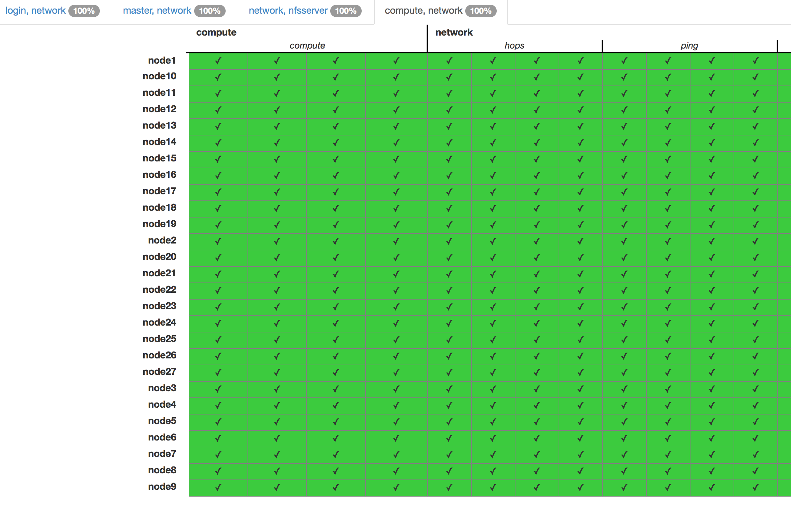

Vagrant Mesh Network with Univa Grid Engine
===========================================

This repository contains a yaml, vagrant and other configuration files for setting up a virtual HPC Cluster Environment.
The execution hosts are connected via a 3D Torus Network.

Needed Software
---------------

* [Ruby](https://www.ruby-lang.org) (Version 2.2.2 or later)
* [Vagrant](https://www.vagrantup.com) (Version 1.7.2 or later)
* [Packer](https://www.packer.io) (Version 0.8.2 or later)
* [VirtualBox](https://www.virtualbox.org) (Version 4.3.30 or later)
* [Serverspec](http://serverspec.org) (Version 2.2.0 or later)
* [Univa Grid Engine](http://www.univa.com) (Version 8.2.0) (Trial Version)

Create the base box
-------------------

Go into the "packer" directory and run

```
[user@host packer]$ rake
Rakefile for creating Box with packer

rake [options]

Options:
   *) build -- Builds the box from template
   *) check -- Checks if the box config is correct
   *) buildcheck -- Builds and checks the box
```

Now choose an option, for this example we choose the *buildcheck* option:

```
[user@host packer]$ rake buildcheck
virtualbox-iso output will be in this color.

...

Machine build correctly. File: centos6-x64.box

...

Finished in 3.74 seconds (files took 38.6 seconds to load)
8 examples, 0 failures

Machine installed correctly
```

After the machine has been build rake outputs that the machine was build correctly. Now the machine is tested if all required porgrams are installed, settings are made correctly and if the vagrant users exist and is able to login via public key over ssh. If it ends with 'Machine installed correctly' everything is fine and the machine is ready to use.

Last you have to add the file *centos6-x64.box* to the vagrant box list:

```sh
[user@host packer]$ vagrant box add centos6 centos6-x64.box
```

Starting up the HPC Cluster
---------------------------

After you created and imported the base box, you just have to say

```sh
[user@host ~]$ vagrant up
```

in the directory where the Vagrantfile is located.

Checking the Cluster
--------------------

Now that the Cluster is running we included some *Serverspec* to check if all hosts are available, if the routing demons are running and if it's possible to submit jobs to the cluster.

First we need to configure our hosts ssh client to recognize our clusternode-names:

```
[user@host ~]$ vagrant ssh config > ~/.ssh/config
```

Now it"s possible to connect via ssh to a node via:

```
[user@host ~]$ ssh login1
```

And you'll be automatically logged in as vagrant.

Now we configure the serverspec Environment.

```sh
[user@host serverspec]$ ls -al
total 32
drwxr-xr-x   7 user  group   238 Jul 31 15:13 .
drwxr-xr-x  21 user  group   714 Aug  5 11:29 ..
-rw-r--r--   1 user  group    99 Jul 31 15:13 Gemfile
-rw-r--r--   1 user  group  5619 Jul 31 15:13 Rakefile
-rw-r--r--   1 user  group   213 Jul 31 15:13 hosts
drwxr-xr-x   8 user  group   272 Jul 31 15:13 spec
drwxr-xr-x   6 user  group   204 Jul 31 15:13 viewer
```

First you need to run:

```
[user@host serverspec]$ bundle install
```

to get all dependencies for serverspec.

Because of the big number of checks, we included a viewer (Thanks to [Vincent Bernat](https://github.com/vincentbernat/serverspec-example)) to check the results of the tests.

To configure the viewer (here [nginx](http://nginx.org) (Version 1.8.0)) we added following configuration file:

```
[user@host ~]$ cat /etc/nginx/conf.d/serverspec.conf
server {
   listen 80;
   server_name host.intern default;

   location / {
      root /path/to/serverspec/viewer;
      index index.html;
   }

   location /reports {
      autoindex on;
      root /path/to/serverspec;
      gzip_static always;
      gzip_http_version 1.0;
      gunzip on;
   }
}
```

Now everything is configured and you can now run serverspec and check the cluster with following command:

```
[user@host serverspec]$ bundle exec rake spec -j 32 -m
```

Options:

* -j $num ... How many paralell tasks can be started.
* -m ... Start rake multithreaded.

After the test has finished you can go to your Webserver and check the tests. If all tests are green the cluster works correctly:



How it works
------------

* First the execution Hosts are set up, and configured to have a working "DNS" and "Routing" service.
* After that the NFS-Servers are setup, and all other machines are are configured to connect to them on specified path.
* Now the Univa Grid Engine is installed.
* Login and the submit of jobs now only works loginnodes.

Examples
--------

To check how many execution hosts are available use *qhost*:

```sh
[vagrant@login1 ~]$ qhost
HOSTNAME                ARCH         NCPU NSOC NCOR NTHR NLOAD  MEMTOT  MEMUSE  SWAPTO  SWAPUS
----------------------------------------------------------------------------------------------
global                  -               -    -    -    -     -       -       -       -       -
node1                   lx-amd64        1    1    1    1  0.03  238.4M   53.7M  791.0M  100.0K
node2                   lx-amd64        1    1    1    1  0.06  238.4M   53.9M  791.0M   96.0K
...
```

To check if the nodes routing daemin is working run:

```sh
[vagrant@login1 ~]$ sudo birdc show ospf topology all
BIRD 1.3.8 ready.

area 0.0.0.0

  router 17.0.0.1
    distance 30
    network 17.0.0.0/30 metric 10
    network 17.0.32.0/30 metric 10
    network 17.0.0.4/30 metric 10
    network 17.0.2.4/30 metric 10
    network 17.0.0.8/30 metric 10
    network 17.0.0.40/30 metric 10
    network 17.1.0.0/30 metric 10

  router 17.0.0.2
    distance 30
...
```
